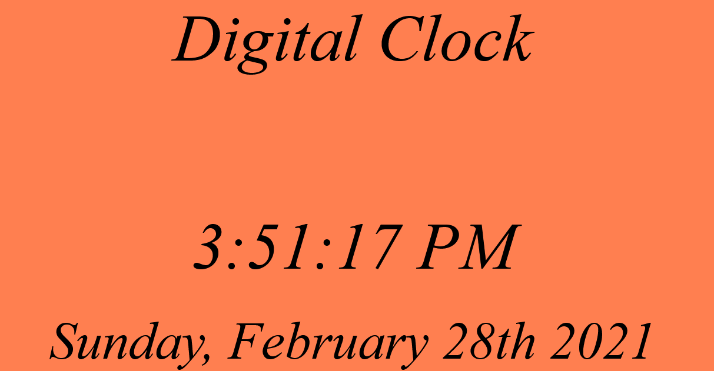

# JavaScript Digital Clock App

A digital clock created with HTML, CSS, and JavaScript.

### Link is located [here](https://iceeeberg.github.io/Clock-App/)

## Summary 

This app was the first one I created on my own. It introduced to me many elements of JavaScript, including how to use the DOM. Getting used to using the Google Chrome Developer Tools was also a great benefit. A first step in the right direction towards my goal of being a software developer.

## Author

Dante Leeseberg - Full Stack Software Devoloper [LinkedIn](linkedin.com/in/dante-leeseberg-bba05883)
